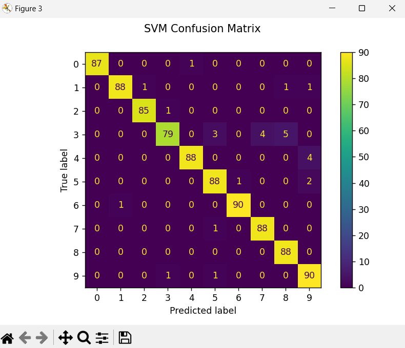

## Classifying Hand-Written Digits by SVM

### SVM
```py
classifier = svm.SVC(gamma=0.001)
``` 
>   + `SVC` : Support Vector Classifier
>   + `gamma` : the higher value (1, or 10) the more overfit and localize model
>   + `kernel` : transform data to higher dimentional space to make it easier for the model to classify.
>        + Default: **`rbf`** *Radial Basis Function*

### Classification Report
``` py 
metrics.classification_report(y_test, prediction) 
```


> + **precision** : From all the data that was **predicted to belong to class 1**, how many of those predictions were actually **correct**?
> + **recall** : From all data that **actually belonged to class 1** how many of them were **predicted as class 1**? 
> + **F1 score** : the balane between `precision` and `recall`
> + **support** : The number of instances availavble for each class in the dataset.

```py
classifier report for SVC(gamma=0.001)

              precision    recall  f1-score   support
           0       1.00      0.99      0.99        88
           1       0.99      0.97      0.98        91
           2       0.99      0.99      0.99        86
           3       0.98      0.87      0.92        91
           4       0.99      0.96      0.97        92
           5       0.95      0.97      0.96        91
           6       0.99      0.99      0.99        91
           7       0.96      0.99      0.97        89
           8       0.94      1.00      0.97        88
           9       0.93      0.98      0.95        92

    accuracy                           0.97       899
   macro avg       0.97      0.97      0.97       899
weighted avg       0.97      0.97      0.97       899 
```

### Confusion Matrix
In a `Confusion Matrix` both correct and wrong predictions can be seen.

```py
confusionMatrix_disp = metrics.ConfusionMatrixDisplay.from_predictions(y_test, prediction)
confusionMatrix_disp.figure_.suptitle("SVM Confusion Matrix")
print(f"confusion Matrix:\n{confusionMatrix_disp.confusion_matrix}")
```

